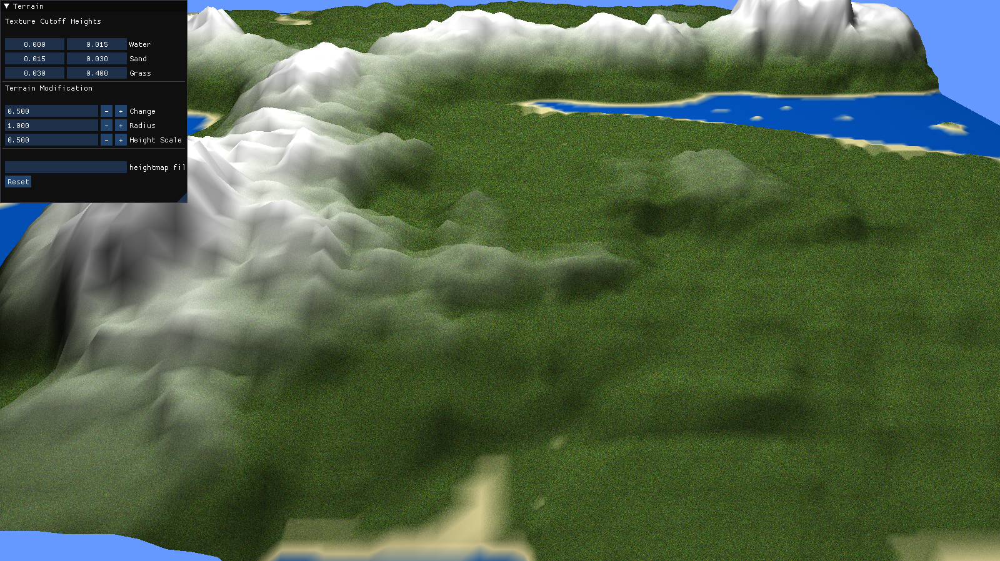

# BlueMarble
Expanding on and customizing the general purpose game engine Hazel (https://github.com/TheCherno/Hazel), in order to focus on map-based explore/expand game/simulation development.

So far have added a terrain system which allows height manipulation and customisable texture bands:

